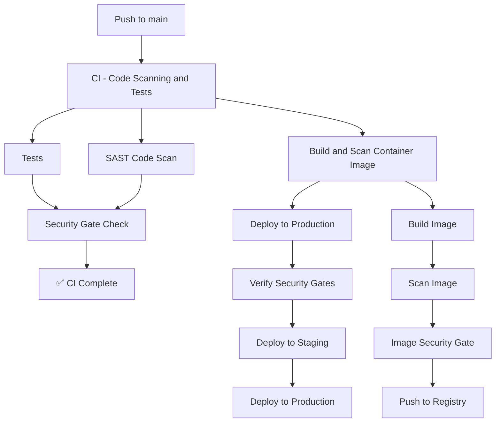

# GitHub Actions Security Gates Demo

This repository demonstrates how to implement security gates in GitHub Actions workflows using only official GitHub actions. The demo shows two key security patterns:

1. **Code Scanning Gate** - SAST scanning that blocks deployment when security issues are found
2. **Image Scanning Gate** - Container image scanning that prevents insecure images from being deployed

## 🎯 Demo Overview

This demo creates a complete CI/CD pipeline with security gates that:

- ✅ Runs automated tests and SAST code scanning in parallel
- ✅ Builds and scans container images for security vulnerabilities  
- ✅ Blocks deployment when security gates fail
- ✅ Only deploys when all security requirements are satisfied
- ✅ Provides clear feedback on security gate status

## 🏗️ Architecture

The demo consists of:

**Application:**
- Simple Node.js Express web server (`app.js`)
- Basic unit tests (`test/app.test.js`)
- Dockerfile for containerization

**Security Scanners (Mock):**
- `scripts/code-scan.js` - Simulates SAST scanning
- `scripts/image-scan.js` - Simulates container vulnerability scanning

**GitHub Actions Workflows:**
- `ci.yml` - Code scanning and testing with security gate
- `build-image.yml` - Image building and scanning with security gate  
- `deploy.yml` - Production deployment (requires security gates to pass)
- `test-gates.yml` - Test different security gate scenarios

## 🚀 Quick Start

### 1. Clone and Setup

```bash
git clone https://github.com/kbridgford/actions-gate-demo.git
cd actions-gate-demo
npm install
```

### 2. Test Locally

```bash
# Run the application
npm start

# Run tests
npm test

# Test security scanners
node scripts/code-scan.js
node scripts/image-scan.js
```

### 3. Trigger Workflows

Push to main branch or create a pull request to see the security gates in action:

```bash
git add .
git commit -m "Test security gates"
git push origin main
```

## 🔒 Security Gates Explained

### Code Scanning Gate

**Location:** `.github/workflows/ci.yml`

**How it works:**
1. Runs SAST scanning in parallel with tests
2. Scans for security patterns like:
   - Hardcoded credentials
   - Security issue markers (`SECURITY-ISSUE:`)
   - Missing authentication
3. Fails the gate if critical or high severity issues found
4. Only allows deployment if code scan passes

**Example gate logic:**
```yaml
# Gate logic: Tests must pass AND no critical/high severity issues
if [[ "${{ needs.test.outputs.test-status }}" == "success" && "${{ needs.code-scan.outputs.scan-status }}" == "PASS" ]]; then
  echo "✅ Security gate PASSED - ready for deployment"
else
  echo "❌ Security gate FAILED - deployment blocked"
  exit 1
fi
```

### Image Scanning Gate

**Location:** `.github/workflows/build-image.yml`

**How it works:**
1. Only runs if CI workflow (including code gates) passed
2. Builds container image without pushing
3. Scans image for:
   - Dockerfile security issues (running as root, latest tags)
   - Base image vulnerabilities 
   - Compliance issues
4. Only pushes image to registry if scan passes
5. Blocks deployment if image has critical vulnerabilities

**Example gate logic:**
```yaml
# Gate logic: No critical issues and limited high severity issues  
if [[ "${{ needs.scan-image.outputs.scan-status }}" == "PASS" ]]; then
  echo "✅ Image security gate PASSED - image ready for deployment"
else
  echo "❌ Image security gate FAILED - image deployment blocked"
  exit 1
fi
```

### Deployment Gate

**Location:** `.github/workflows/deploy.yml`

**How it works:**
1. Only runs if both CI and image build workflows completed successfully
2. Verifies that all upstream security gates passed
3. Deploys to staging first, then production
4. Each deployment step reaffirms security gate status

## 🧪 Testing Different Scenarios

### Test All Scenarios (Recommended)
```bash
# Go to GitHub Actions tab and run "Test Security Gates" workflow
# Select "all" to test pass/fail scenarios
```

### Test Individual Scenarios

**1. All Gates Pass:**
- Current code has intentional security issues but they're marked as "MEDIUM"
- Should demonstrate successful deployment

**2. Code Scanning Fails:**
```bash
# Add these lines to app.js to trigger failures:
// VULNERABILITY: SQL injection risk
// SECURITY-ISSUE: XSS vulnerability
```

**3. Image Scanning Fails:**
```bash
# Add these lines to Dockerfile:
# SECURITY-ISSUE: Additional vulnerability  
USER root
```

### Manual Testing
Use the "Test Security Gates" workflow in GitHub Actions:
1. Go to Actions tab
2. Click "Test Security Gates"
3. Click "Run workflow" 
4. Select scenario: `all`, `pass`, `code-fail`, or `image-fail`

## 📊 Workflow Dependencies



## 🔧 Configuration

### Security Thresholds

**Code Scanning:**
- CRITICAL issues: ❌ Always fail
- HIGH issues: ❌ Always fail  
- MEDIUM issues: ✅ Allow
- LOW issues: ✅ Allow

**Image Scanning:**
- CRITICAL issues: ❌ Always fail
- HIGH issues: ❌ Fail if > 5 issues
- MEDIUM/LOW issues: ✅ Allow

### Customizing Scanners

Edit the scanner scripts to change detection patterns:

**Code Scanner (`scripts/code-scan.js`):**
```javascript
const SECURITY_PATTERNS = [
  {
    pattern: /your-pattern/gi,
    severity: 'HIGH',
    description: 'Your security check'
  }
];
```

**Image Scanner (`scripts/image-scan.js`):**
```javascript
const IMAGE_SECURITY_PATTERNS = [
  {
    pattern: /FROM.*:latest/gi,
    severity: 'MEDIUM', 
    description: 'Using latest tag'
  }
];
```

## 🚨 Common Issues

### 1. Workflow Not Triggering
- Ensure you're pushing to `main` branch
- Check that workflow files are in `.github/workflows/`
- Verify YAML syntax is valid

### 2. Permission Errors
- Ensure `GITHUB_TOKEN` has necessary permissions
- Check repository settings > Actions > General > Workflow permissions

### 3. Container Registry Issues
- Verify GitHub Package Registry is enabled
- Check that `GITHUB_TOKEN` has `write:packages` permission

### 4. Scanner Failures
- Check Node.js is available in the runner
- Verify scanner script paths are correct
- Review scanner output for specific errors

## 🎓 Key Learning Points

1. **Defense in Depth**: Multiple security gates provide layered protection
2. **Fail Fast**: Security issues are caught early in the pipeline  
3. **Automation**: No manual intervention required for security checks
4. **Visibility**: Clear feedback on what security issues block deployment
5. **Official Actions Only**: Demonstrates security without third-party dependencies

## 📋 GitHub Actions Used

This demo only uses official GitHub actions:

- `actions/checkout@v4` - Code checkout
- `actions/setup-node@v4` - Node.js setup  
- `actions/upload-artifact@v4` - Artifact upload
- `actions/download-artifact@v4` - Artifact download
- `docker/setup-buildx-action@v3` - Docker Buildx
- `docker/login-action@v3` - Registry login
- `docker/metadata-action@v5` - Image metadata
- `docker/build-push-action@v5` - Image build
- `actions/github-script@v7` - GitHub API scripting

## 🔗 Related Resources

- [GitHub Actions Documentation](https://docs.github.com/en/actions)
- [GitHub Security Best Practices](https://docs.github.com/en/code-security)
- [Container Security Guide](https://docs.github.com/en/packages/working-with-a-github-packages-registry/working-with-the-container-registry)

## 📝 License

MIT License - see LICENSE file for details.

---

🔒 **Security Note:** This is a demonstration repository with intentional security issues for testing purposes. Do not use in production without proper security review.